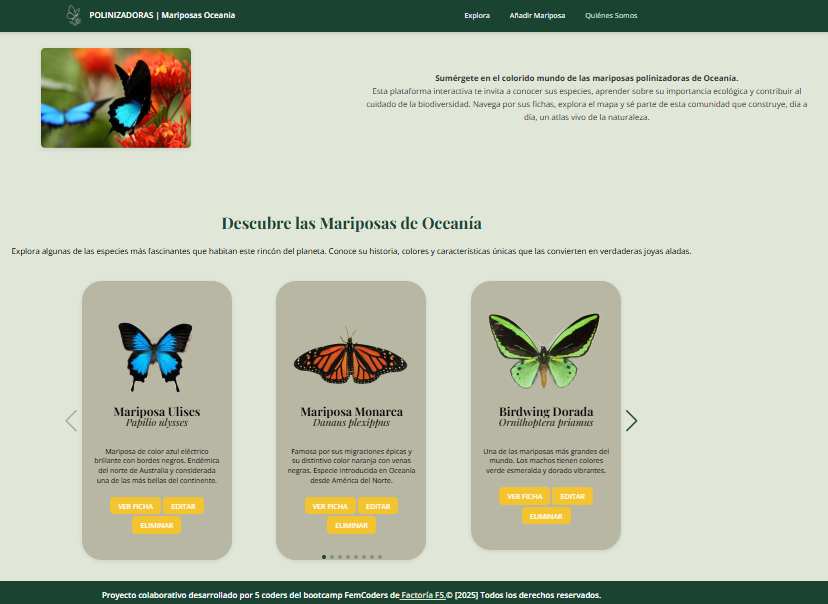
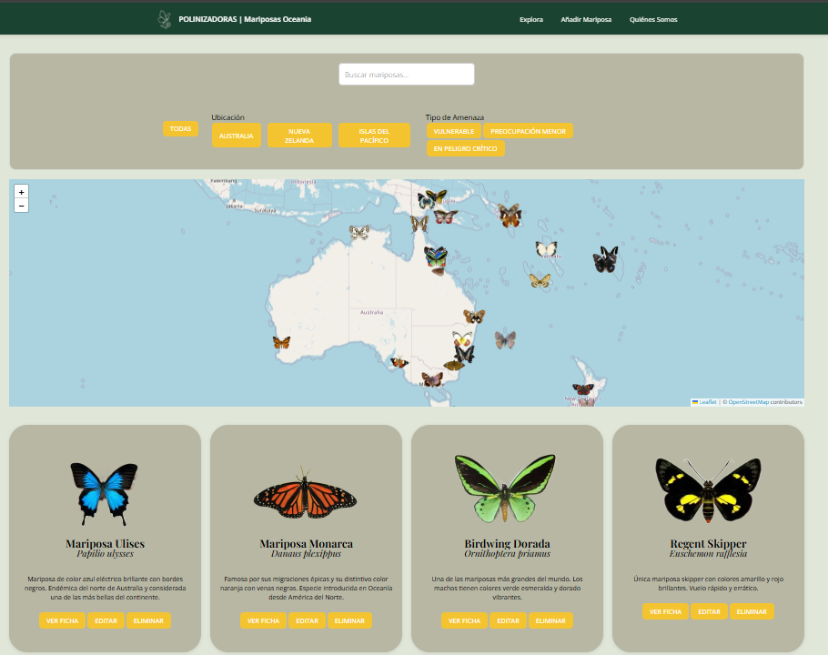
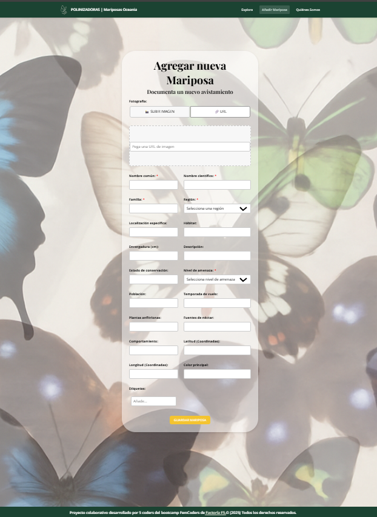
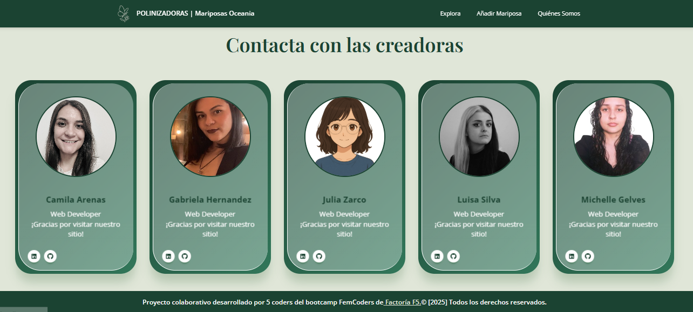
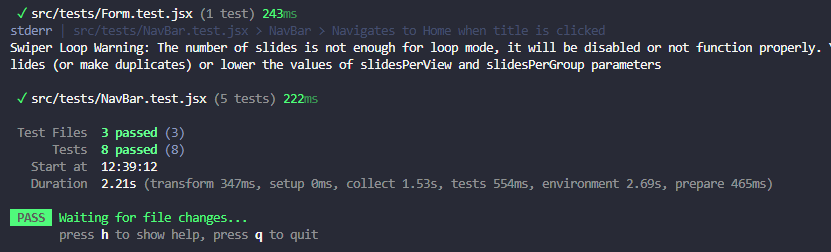
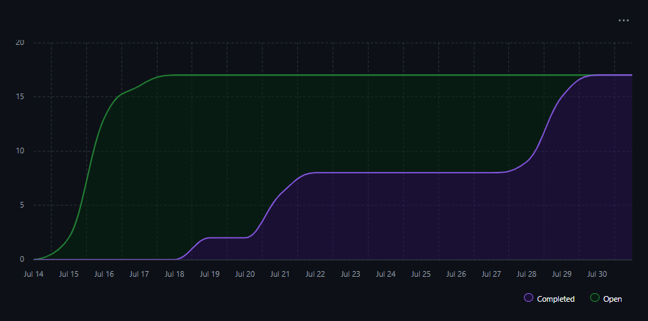

# 🦋 Mariposas Polinizadoras de Oceanía

**Mariposas Polinizadoras de Oceanía** es una plataforma interactiva desarrollada por un equipo de 5 coder, como parte de un proyecto llamado "polinzadoras" del grupo FemCoders de Factoria F5.

## 🧭 Objetivo

A través de esta aplicación, buscamos crear conciencia sobre la biodiversidad y el papel esencial de estos insectos en el equilibrio de la naturaleza. Sin ellas, muchas especies vegetales no podrían reproducirse y el ciclo de la vida se vería gravemente afectado. Este proyecto es una invitación a conocerlas, protegerlas y apreciar su importancia.

---

## 🌐 Demo

A continuación se muestran capturas reales de la aplicación en funcionamiento:

Pagina principal con carrusel de imagenes              ---->
Se despliega el mapa y la lista completa de las cards  ---->
Formulario para añadir mariposa                        ---->
Pagina para contactar con las creadoras
---->

## ✨ Funcionalidades

- 🖼️ Carrusel de tarjetas con información destacada sobre mariposas.
- 🗺️ Mapa interactivo con la distribución geográfica de las especies.
- 📄 Vista de tarjetas con funciones de:
  - 🗑️ Eliminar mariposa
  - ✏️ Editar mariposa
  - ➕ Agregar nueva mariposa mediante formulario
- 📬 Página de contacto con fotografías del equipo desarrollador.
- 📱 Estilo responsive: diseño adaptado a diferentes dispositivos.

---

## ⚙️ Tecnologías utilizadas

- **React + Vite**: Frontend moderno y rápido.
- **CSS**: Estilizado personalizado.
- **Styled-components**: Estilizado basado en componentes.
- **React Router**: Navegación entre páginas.
- **React Leaflet + Leaflet**: Visualización de mapas.
- **Axios**: Cliente HTTP para consumir nuestra API local.
- **SweetAlert2**: Alertas visuales personalizadas.
- **Swiper**: Carrusel interactivo de mariposas.
- **Vitest**: Framework de testing moderno y rápido.
- **Cloudinary**: Almacenamiento y optimización de imágenes.
- **Node.js (requerido)**: Entorno para ejecutar el backend localmente.
- **Testing-library**: Utilidad de React para testear el comportamiento de los componentes.

---

## 📁 Estructura del proyecto

```bash
📦 src/
 ┣ 📂assets/           # Imágenes y recursos estáticos
 ┣ 📂components/       # Componentes reutilizables
 ┣ 📂layout/           # Componentes generales de estructura
 ┣ 📂pages/            # Páginas principales
 ┣ 📂router/           # Definición de rutas
 ┣ 📂services/         # Lógica de conexión con la API
 ┣ 📜main.jsx          # Punto de entrada de React
 ┗ 📜index.css         # Estilos globales
```
---

## 🧠 Diseño UX/UI
🎨 Diseño desarrollado en Figma.

🧾 Las decisiones de estilo (colores, tipografía, layout) fueron tomadas en conjunto por el equipo.

[Oceania Butterflies (Figma)](https://www.figma.com/design/9UZKLUN5UjH4WxoPsPogVu/Grupo-5-Oceania?node-id=0-1&p=f&t=jH7g2u1TeLkzgSZ8-0)

---

## 🚀 Instalación y ejecución
🔧 Requisitos previos
Tener instalado Node.js (versión recomendada: 18+)

## 🛠️ Pasos para ejecutar el proyecto

# Clonar el repositorio
git clone https://github.com/MichelleGel/Oceania-Butterflies.git

cd Oceania-Butterflies

# Instalar dependencias
npm install

# Levantar el frontend
npm run dev

# Levantar la API simulada (JSON Server)
npm run api

# Ejecutar tests
npm run test

---

## 🧪 Testing
El proyecto utiliza Vitest para realizar pruebas unitarias y de integración en los componentes clave. Esto nos permite asegurar la calidad del código a medida que el proyecto evoluciona.



---

## 🐛 Control de versiones
Usamos Git con una estructura de trabajo colaborativa basada en ramas:

main: rama principal con el código final listo para producción.

develop: rama de integración donde se combinan las funcionalidades.

Cada coder trabajó en ramas individuales, que luego fueron integradas a develop mediante pull requests.



---

## 👥 Equipo de desarrollo
Este proyecto fue realizado por 5 desarrolladoras como parte de un trabajo colaborativo. Una de las integrantes asumió el rol de Scrum Master, organizando tareas, deadlines y sprints con metodología ágil.
```
Michelle ---> Scrum Master, Developer.
Camila ----> Developer.
Gabriela --> Developer.
Julia -----> Product Owner, Developer.
Luisa -----> Developer.
```
---

## 🤝 Agradecimientos
Este proyecto ha sido posible gracias a la colaboración y esfuerzo conjunto del equipo y el acompañamiento del bootcamp de Factoría F5 (Celia Millán & Ana Aragón).

